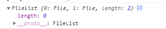

## Upload
- 设置input display为none隐藏，当点击这个组件时获取input的dom.click()来主动触发点击事件(这个是html5规范新增的，input:file 可以伪触发选择文件)
``` js
  handleClick () {
      this.$refs.input.click();
  },
```
- 当触发onChange事件会获取files， 但事件中返回的是类数组


使用了Array.prototype.slice.call(arguments)将伪数组转换为真正的数组，这个方法可以能将具有length属性的对象转成数组。
``` js
  uploadFiles (files) {
      let postFiles = Array.prototype.slice.call(files);
      if (!this.multiple) postFiles = postFiles.slice(0, 1);

      if (postFiles.length === 0) return;

      postFiles.forEach(file => {
          this.upload(file);
      });
  },
```

这个组件使用filelist管理上传的文件就不细细说了