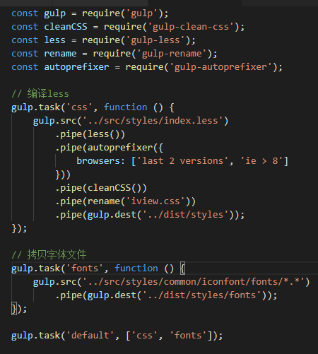

# style

iview用的预处理器是less，并且是用gulp打包的，



## custom
定义了一些颜色 尺寸等css信息

## minxins
利用less中的混入写了很多公共css函数

## animation
写的是一些css的animation和vue的过度class

## common
字体，css格式化，
---
## iview定制主题原理

``` less
@import '~iview/src/styles/index.less';

// Here are the variables to cover, such as:
@primary-color: #8c0776;
```
后面定义的变量会覆盖掉iview中在custom中定义的变量
---
### 解决在vue中使用scoped不能直接改变iview的class
应为scoped会加上自定义属性来做到模块化，但不能给子组件也就是引用的iview的组件加上自定义属性，所以不在一个css作用于中，从vue-loader官网中查阅到，可以使用深度选择器
``` less
<style scoped>
.a >>> .b { /* ... */ }
</style>
```
上述代码会编译为
``` less
<style scoped>
.a[data-v-f3f3eg9] .b { /* ... */ }
</style>
```
在less中需要使用/deep来代替>>>
``` less
<style scoped>
.a /deep/ .b { /* ... */ }
</style>
```

## less查缺补漏
- Selectors
``` less
// Variables
@my-selector: banner;

// Usage
.@{my-selector} {
  font-weight: bold;
  line-height: 40px;
  margin: 0 auto;
}
```
``` less
// Variables
.banner {
  font-weight: bold;
  line-height: 40px;
  margin: 0 auto;
}
```